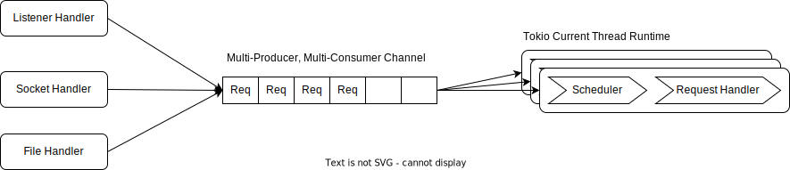

# Background

The [`dbs-fuse`](https://crates.io/crates/dbs-fuse) crate acts as a wrapper over [tokio](https://github.com/tokio-rs/tokio) and [tokio-uring](https://github.com/tokio-rs/tokio-uring)
to support asynchronous IO for [fuse-backend-rs](https://github.com/cloud-hypervisor/fuse-backend-rs) and [Nydus Image Serivce](https://github.com/dragonflyoss/image-service).

The [tokio::runtime](https://docs.rs/tokio/latest/tokio/runtime/index.html) supports two types of schedulers:
- Multi-Thread Scheduler: The multi-thread scheduler executes futures on a thread pool, using a work-stealing strategy. By default, it will start a worker thread for each CPU core available on the system. This tends to be the ideal configuration for most applications.
- Current-Thread Scheduler: The current-thread scheduler provides a single-threaded future executor. All tasks will be created and executed on the current thread. 

For more information about tokio schedulers, please refer to [Making the Tokio scheduler 10x faster](https://tokio.rs/blog/2019-10-scheduler).

On the other hand, we think io-uring is the future:)
Quotation from the [tokio design doc](https://github.com/tokio-rs/tokio-uring/pull/1):
```
Tokio's current Linux implementation uses non-blocking system calls and epoll for event notification.
With epoll, a tuned TCP proxy will spend 70% to 80% of CPU cycles outside of userspace, including
cycles spent performing syscalls and copying data between the kernel and userspace.
In 2019, Linux added a new API, io-uring, which reduces overhead by eliminating most syscalls and
mapping memory regions used for byte buffers ahead of time. Early benchmarks comparing io-uring
against epoll are promising; a TCP echo client and server implemented in C show up to 60% improvement.
Though not yet measured, using io-uring instead of Tokio's thread-pool strategy will likely provide
significant gains for file system operations.
```
And we have tried several rounds to enable asynchronous IO with io-uring:
- [Ringbahn](https://github.com/ringbahn/ringbahn) and [uring-sys](https://github.com/ringbahn/uring-sys) based implementation. But the `ringbahn` project seems to have been abandoned.
- [Ringbahn](https://github.com/ringbahn/ringbahn) and [io-uring](https://github.com/tokio-rs/io-uring) based implementation. Abandoned too.
- [tokio-uring](https://github.com/tokio-rs/tokio-uring) and [io-uring](https://github.com/tokio-rs/io-uring) based implementation. Still inprogress.

# Design Goals
- Improve performance of IO intensive workloads
- Reduce number of worker threads
- Support systems with and without io-uring
- Ease to use

# Architecture Design

## Task Scheduler for IO Uring

It's challenging to enable io-uring based asynchronous IO. Another quotation from the [tokio design doc](https://github.com/tokio-rs/tokio-uring/pull/1):
```
The queue's single-producer characteristic optimizes for a single thread to own a given submission queue.
Supporting a multi-threaded runtime requires either synchronizing pushing onto the submission queue or
creating a queue pair per thread. The tokio-uring runtime uses an isolated thread-per-core model,
differing from Tokio's other runtimes. Unlike Tokio's primary multi-threaded runtime, there is no
work-stealing. Tasks remain on the thread that spawned them for the duration of their lifecycle.
Each runtime thread will own a dedicated submission and completion queue pair, and operations are submitted
using the submission queue associated with the current thread. Operation completion futures will not
implement Send, guaranteeing that they remain on the thread to receive the operation result.
Interestingly, the resources, e.g., TcpListener, can be Send as long as they do not hold operation futures
internally. It is possible to have two operations in-flight from a single resource associated with different
queues and threads.
```

Based on the constraints of the tokio-uring framework, we adopts the following architecture with:
- A multi-producer, multi-consumer channel as an queue for pending requests.
- Multiple worker threads to fetch requests from the mpmc channel and process those requests with asynchronous IO.
- A request scheduler per worker threads to evenly distribute requests among worker threads.
- A tokio current thread Runtime per worker thread, to support asynchronous IO.

Unlike the tokio default multi-thread Runtime, which provides task scheduler to balance workloads among worker threads, we need to implement our own task scheduler.



## Support both tokio and tokio-uring
It's challenging to enable io-uring based asynchronous IO, it's even more challenging to support both io-uring based and non-io-uring based async io.

### Task Scheduler
We hope to support both systems with io-uring and systems without io-uring.
There are two possible solutions for task scheduler:
- Use current thread Runtime for io-uring based async io and use multi-threaded Runtime for non-io-uring based async io.
- Use current thread Runtime for both io-uring based and non-io-uring based async io.

The current thread Runtime may not be as optimized as the default multi-threaded Runtime. 
But for simplicity and maintenance, we use current thread Runtime for both io-uring based and non-io-uring based async io.

### Wrapper Structures
Both tokio and tokio-uring defines their own data types to support async io.
Though we introduce several wrapper data types to support both io-uring based and non-io-uring based async io:
- Runtime
- File
- FileVolatileBuf


